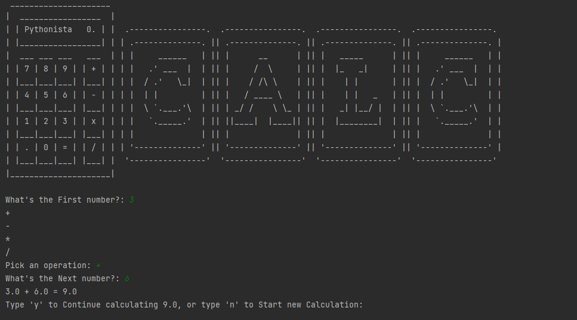

# Calculator

## A simple Calculator to help you with everyday math problems.

### This is a very basic calculator with four basic arithmetic functionality (addition, subtraction, multiplication, division). The Screen also clears after the current calculation is done.

## Things I learned doing this project.

1. The OS module, cls and clear functions.
2. Adding variables (functions) in dictionary.
3. Type Casting.
4. While Loop.